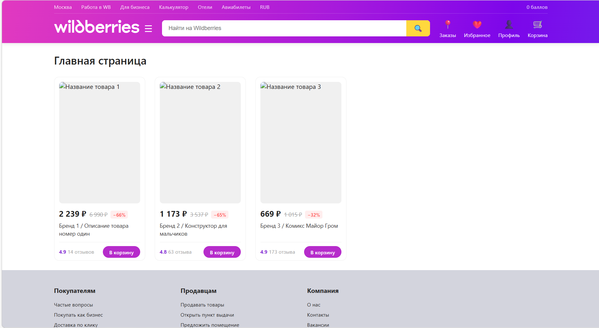
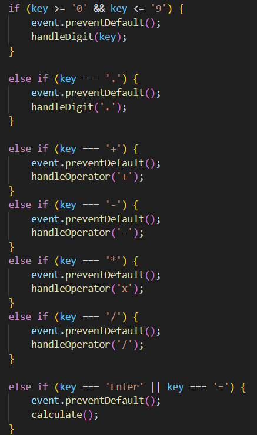
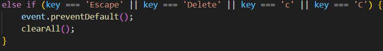
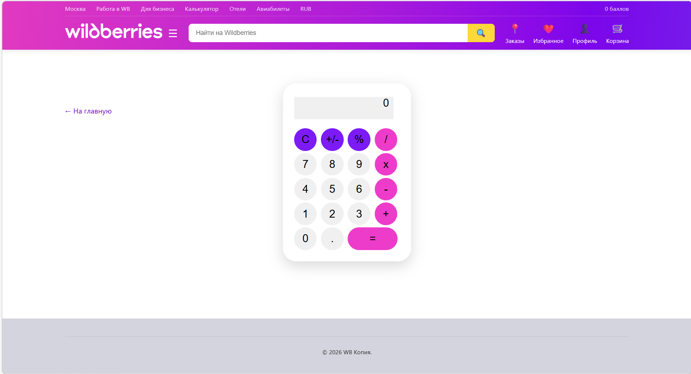

# ЛР 1. Calculator. HTML/CSS
# Задание: Создание калькулятора. Верстка на HTML, CSS.
# Тема: Размещение товаров на маркетплейсе (за основу взят сайт маркетплейса Wildberries)
**Цель данной лабораторной работы** — знакомство с инструментами построения пользовательских интерфейсов web-сайтов: HTML, CSS. В ходе выполнения работы вам предстоит ознакомиться с кодом реализации простого калькулятора и затем выполнить задания по варианту.

---

## План работы

1. **HTML-разметка**
2. **Базовая структура HTML-документа**
3. **Создание проекта**
4. **Верстка калькулятора**
5. **CSS**
6. **Применение CSS к HTML-документу**
7. **Стилизация верстки калькулятора с помощью CSS**

## Результаты

### Исходный сайт

### Главная страница копии сайта

### Страница товара исходного сайта

### Страница товара копии сайта

### Калькулятор
