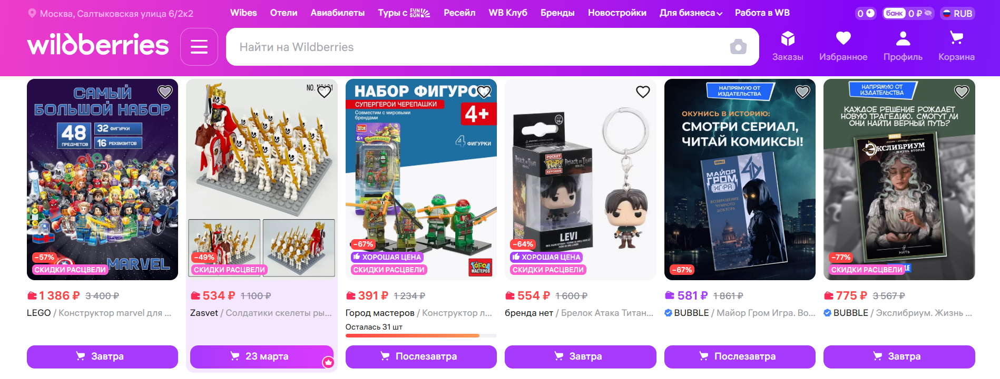

# ЛР 2. Calculator. JavaScript
# Задание: Создание калькулятора. Верстка на HTML, CSS.
# Тема: Размещение товаров на маркетплейсе (за основу взят сайт маркетплейса Wildberries)
**Цель данной лабораторной работы** — знакомство с инструментами построения пользовательских интерфейсов web-сайтов: HTML, CSS, JavaScript. В ходе выполнения работы, вам предстоит продолжить реализовывать простой калькулятор, и затем выполнить задания по варианту.

---

## План работы

1. **Программирование логики с помощью JavaScript**
2. **Доступ к HTML-элементам из JavaScript**
3. **Программирование кнопок калькулятора**
4. **Запуск калькулятора с помощью LiveServer**
5. **Задание**

## Результаты

### Калькулятор


## Изменения

1. **Все цифры и операции над числами можно вводить не только с помощью кнопок, но и непосредственно с клавиатуры**
```javascript
if (key >= '0' && key <= '9') {
    event.preventDefault();
    handleDigit(key);
}

else if (key === '.') {
    event.preventDefault();
    handleDigit('.');
}
    
else if (key === '+') {
    event.preventDefault();
    handleOperator('+');
}
else if (key === '-') {
    event.preventDefault();
    handleOperator('-');
}
else if (key === '*') {
    event.preventDefault();
    handleOperator('x');
}
else if (key === '/') {
    event.preventDefault();
    handleOperator('/');
}

else if (key === 'Enter' || key === '=') {
    event.preventDefault();
    calculate();
}

else if (key === 'Escape' || key === 'Delete' || key === 'c' || key === 'C') {
    event.preventDefault();
    clearAll();
}
