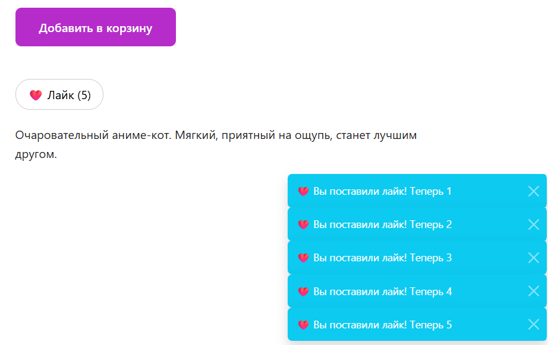
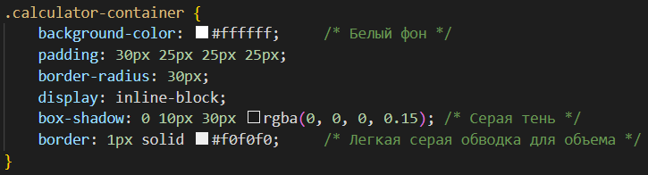

# ЛР 3. Простое веб-приложение. Верстка
# Задание: Знакомство с node, npm. Верстка интерфейса с карточками (страница списка с фильтрацией и страница подробнее), данные получать через mock объекты (коллекция). Добавить кнопку добавления (копировать первую карточку), кнопку удаления карточки. В хедере на обеих страницах должна быть кнопка Домой
# Тема: Размещение товаров на маркетплейсе (за основу взят сайт маркетплейса Wildberries)
**Цель данной лабораторной работы** — знакомство с node, npm, написание простого приложения на JavaScript. В ходе выполнения работы, вам предстоит ознакомиться с кодом реализации простого интерфейса и вывода данных, и затем выполнить задания по варианту.
**Вариант 2:** Тема - кошки, Компонент - уведомления.
---

## План работы

1. **Инструменты для работы**
2. **Что такое node, npm и package.json**
3. **Как работать с html в JS**
4. **Инициализация проекта**
5. **Создание главной страницы, подключение bootstrap**
6. **Простая кнопка на JavaScript**
7. **Структурирование проекта**
8. **Верстка главной страницы**
9. **Верстка страницы продукта**

## Результаты

### Главная страница (изначальное положение)

### Копирование первой карточки + уведомление

### Удаление второй карточки + уведомление

### Страница карточки + уведомление

## Дополнительное задание

1. **К каждой карточке добавлена кнопка "лайк"; количество нажатых лайков сохраняется**

